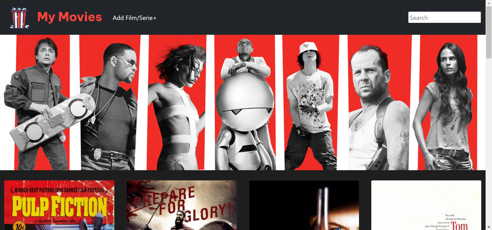

# Filmoteca

## About the project
This project is part of a formation course by FactoriaF5 where de main goal is to adquire the ability to create a fully functional web page that can acces a fake api and gives the user the possibility to do the CRUD (Create, Read, Update and Delete).

## The page
My Movies is a web page where the user can save watched movies as well as seen te movies list with all the information displayed as wel as deleting the movies. Another feature is the searchbar which the user can use to search a specific movie. The web app is completely responsive and works on phone and tablet.

## The repo structure
This repo contains several documents and folders. There are two folders for the CSS and the JavaScript documents as well as a folder for the images, logo and resources. Then there is an index.html and the JSON document that acts as a fake api

## How to use
This is a public repo so anyone who wants to usit feel free to clone it.
`https://github.com/UriCV/Filmoteca`
If you want to use this repo you should clone it and install the server that will acces the fake api with the following comand:

Linux, Mac:
   		`sudo npm install -g json-server`
 
Windows:
		`npm install -g json-server`

Then launch the server: `json-server --watch peliculas.json`

## Future versions
For next updates the user will be able tho edit the information of the movies (update from CRUD) as well as the ability to add comments to the movies. The user will also be provided with a confirmation message before deleting a movie.

## Tools that made possible this project
- HTML
- CSS
- GitHub
- Figma
- VScode
- Bootstrap
- Postman

## Author
- [Uri C. V.](https://github.com/UriCV)

## Acknowledgments
Thanks to FactoriaF5 🧡 for training future coders!